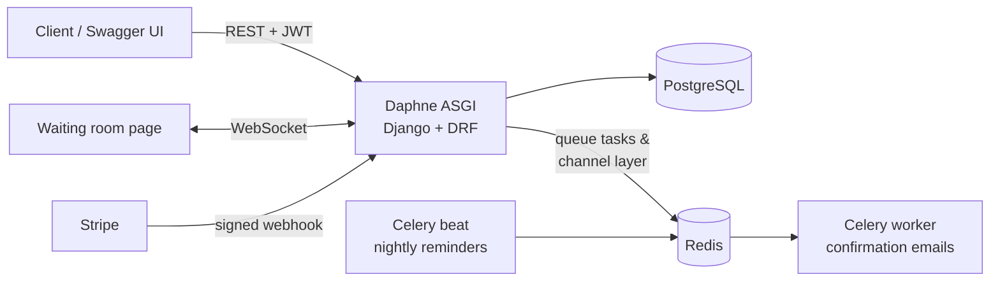

# ClinicFlow

[](https://github.com/asfawayalk/clinicflow/actions/workflows/ci.yml)

**A clinic appointment & queue management API** — built as a compact, production-patterned
showcase of the Django backend stack: REST APIs, JWT auth with roles, async tasks,
scheduled jobs, WebSockets, and Stripe payments, all Dockerized and tested in CI.

Patients register and book appointments. A confirmation email goes out asynchronously,
the waiting-room screen updates live over WebSockets, a nightly job sends reminders,
and the booking fee is paid through Stripe Checkout with a signature-verified webhook.

> Built feature by feature in small, reviewable commits — read the git history to follow along.

## Try it in two commands

```bash
docker compose up --build
docker compose exec web python manage.py seed_demo
```

| Page | URL |
|---|---|
| Landing page | http://localhost:8000/ |
| Swagger UI (interactive API docs) | http://localhost:8000/api/docs/ |
| Live waiting room (WebSockets) | http://localhost:8000/queue/ |
| Django admin | http://localhost:8000/admin/ |

Demo logins (password `demo-pass-123` for all): `admin` · `receptionist` · `dr.jane` · `patient`

**60-second demo:** open `/queue/` in one tab. In another, open `/api/docs/`, call
`POST /api/auth/token/` as `receptionist`, click **Authorize**, and `PATCH` an appointment
to `checked_in` — watch the queue update instantly.

## Architecture



Five Docker services: `web` (Daphne/ASGI), `db` (PostgreSQL 17), `redis`,
`worker` (Celery), `beat` (Celery-beat). Settings are environment-driven with sensible
dev fallbacks — without Docker it runs on SQLite, an in-memory channel layer, and eager
Celery tasks, so `manage.py runserver` works with zero setup.

## Features

- **REST API** (Django REST Framework) — doctors, patients, appointments; validation
  rejects past-dated bookings and double-books (also enforced by a DB constraint);
  filter by `?status=` / `?doctor=`
- **OpenAPI 3 docs** (drf-spectacular) — Swagger UI at `/api/docs/`, ReDoc at `/api/redoc/`
- **JWT auth** (simple-jwt) — register / token / refresh / me; password validation;
  docs stay public, everything else requires auth
- **Role-based permissions** — self-registration creates a *patient* (with linked record);
  patients see and book only for themselves, doctors see their own schedule,
  receptionists manage everything; roles assigned in admin
- **Async emails** (Celery + Redis) — booking confirmation queued from a `post_save`
  signal via `transaction.on_commit`
- **Scheduled jobs** (Celery-beat) — nightly reminder for tomorrow's appointments
- **Stripe payments** (test mode) — `POST /api/appointments/{id}/pay/` returns a Checkout
  URL; webhook verifies the Stripe signature and marks the payment paid
- **Live queue** (Django Channels) — `/queue/` shows today's appointments and updates in
  real time on every booking and check-in
- **Seed command** — `manage.py seed_demo`, idempotent, demo users for every role
- **Tests + CI** — 26 pytest tests (auth, role matrix, validation, payments with real
  HMAC webhook signatures, tasks, WebSockets); GitHub Actions runs tests, system checks,
  and OpenAPI validation on every push

## API overview

| Method | Endpoint | Who |
|---|---|---|
| POST | `/api/auth/register/` | public |
| POST | `/api/auth/token/`, `/api/auth/token/refresh/` | public |
| GET | `/api/auth/me/` | any authenticated |
| GET/POST/PUT/PATCH/DELETE | `/api/doctors/` | read: any · write: receptionist |
| GET/POST/PUT/PATCH/DELETE | `/api/patients/` | receptionist · patients see only themselves |
| GET/POST | `/api/appointments/` | role-filtered; patients book for themselves |
| PUT/PATCH/DELETE | `/api/appointments/{id}/` | receptionist |
| POST | `/api/appointments/{id}/pay/` | owner / receptionist |
| POST | `/api/stripe/webhook/` | Stripe (signature-verified) |
| WS | `/ws/queue/` | waiting-room display |

Full interactive documentation at `/api/docs/`.

## Local development (no Docker)

```bash
python -m venv .venv && .venv/bin/pip install -r requirements-dev.txt
.venv/bin/python manage.py migrate
.venv/bin/python manage.py seed_demo
.venv/bin/python manage.py runserver   # SQLite, eager tasks, in-memory channels
.venv/bin/python -m pytest             # run the test suite
```

### Enabling Stripe (optional)

```bash
export STRIPE_SECRET_KEY=sk_test_...
export STRIPE_WEBHOOK_SECRET=whsec_...   # from: stripe listen --forward-to localhost:8000/api/stripe/webhook/
```

## Deployment (Render + Neon, free tier)

The repo ships with a `render.yaml` blueprint. The free deployment runs a single web
service (Daphne): Celery executes eagerly and the channel layer is in-memory, which
behaves identically on one instance — the full worker/beat/Redis topology is
demonstrated by `docker-compose.yml`.

1. Create a free Postgres database at [neon.tech](https://neon.tech) and copy its connection string.
2. On [render.com](https://render.com): **New → Blueprint**, pick this repo.
3. When prompted, paste the Neon connection string as `DATABASE_URL`.

The start command migrates, seeds demo data, and serves with Daphne. Note: the free
instance sleeps when idle — the first request after a pause takes ~30–60 s.

## Stack

Python 3.14 · Django 6 · Django REST Framework · Django Channels (Daphne) ·
Celery + Celery-beat · PostgreSQL 17 · Redis · Stripe · Docker Compose ·
pytest · GitHub Actions

## Author

**Asfaw Ayalkibet** — senior backend developer (Django/DRF). This repository is a
portfolio piece: every feature is intentionally small, self-contained, and verifiable.
